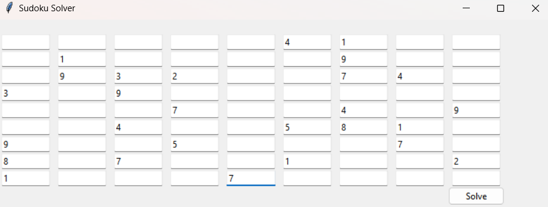
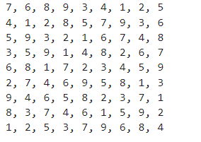

# Sudoku_solver

## sudoku solver implemented with jupyter notebook

## Install require libraries

Example use the code:
1. Run all the cells
2. Enter the date

3. press `solve`
4. close the GUI window

Output show below:
